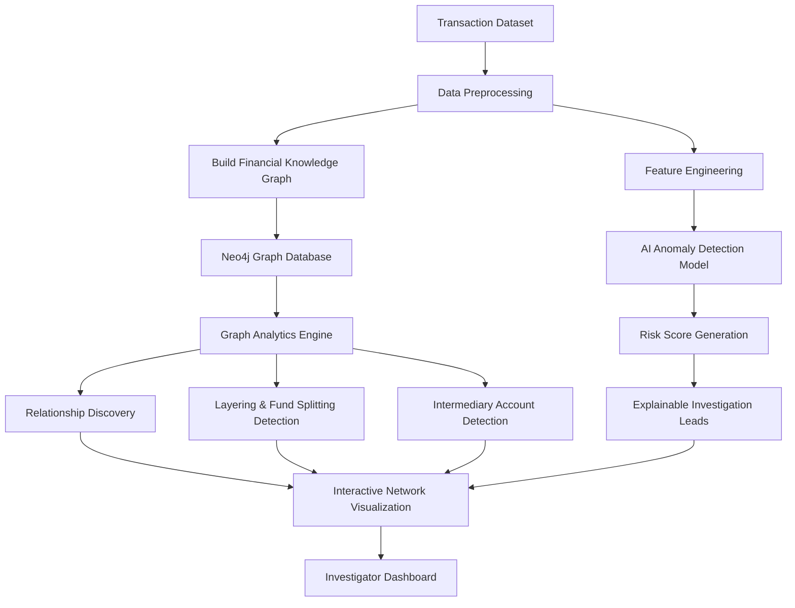

# 💸 CrimeNet AI – AI-Powered Money Laundering Detection & Financial Network Analysis

CrimeNet AI is an AI-powered financial investigation platform that detects and analyzes potential money-laundering activities using Artificial Intelligence, Graph Analytics, and Financial Knowledge Graphs. The system transforms fragmented transaction records into an interactive network of accounts, individuals, businesses, and transactions, enabling investigators to uncover suspicious money flows, hidden relationships, layering, and intermediary accounts through explainable AI.

---

# 💡 Problem Statement

Money laundering often involves thousands of interconnected transactions spread across multiple accounts, businesses, and intermediaries. Traditional investigation methods struggle to identify complex laundering patterns such as layering, fund splitting, circular transactions, and hidden financial relationships.

CrimeNet AI provides an intelligent financial investigation platform that automatically detects suspicious transaction behavior, builds financial relationship graphs, and generates explainable investigation leads for human analysts.

---

# 🔥 Innovation

CrimeNet AI combines multiple AI and graph analysis techniques into one investigation platform:

- AI-powered anomaly detection for suspicious transactions.
- Financial Knowledge Graph generation.
- Transaction flow and layering detection.
- Hidden relationship discovery using graph analytics.
- Explainable AI-based risk scoring.
- Interactive financial network visualization.
- Human-in-the-loop investigation workflow.

---

# 🌍 Why This Project Matters

Financial crimes such as money laundering, fraud, terror financing, and shell-company transactions are becoming increasingly complex.

CrimeNet AI helps investigators analyze massive transaction datasets quickly by identifying suspicious financial behavior, tracing money movement across multiple entities, and discovering hidden networks that would otherwise be difficult to detect manually.

The platform improves investigation efficiency while ensuring that AI-generated alerts remain transparent and explainable.

---

# 🏦 Real World Applications

- 💰 Money Laundering Investigation
- 🏛 Financial Intelligence Units (FIU)
- 🏦 Banking Fraud Detection
- 🕵 Law Enforcement Investigation Support
- 📊 AML (Anti-Money Laundering) Compliance
- 🌐 Financial Network Risk Analysis
- 🧠 AI-Assisted Financial Crime Investigation

---

# ⚙️ Workflow Diagram



---

# 🔍 How It Works

1. Transaction data is collected and preprocessed.
2. Features such as transaction frequency, amount, account behavior, and transaction patterns are extracted.
3. AI models analyze transactions to detect anomalous behavior.
4. A Financial Knowledge Graph is created linking accounts, individuals, businesses, and transactions.
5. Graph analytics identify suspicious paths, hidden relationships, layering, and intermediary accounts.
6. Each suspicious entity receives an explainable risk score.
7. Investigators explore suspicious transaction networks through an interactive visualization dashboard.

---

# 🛠️ Technologies Used

## Programming Languages

- Python
- TypeScript
- JavaScript
- SQL

## Backend

- FastAPI
- PostgreSQL
- Neo4j
- Pandas
- Scikit-learn

## Frontend

- React
- TypeScript
- Cytoscape.js
- Tailwind CSS

## Tools & DevOps

- Docker
- REST APIs
- Git & GitHub

---

# 🤖 AI & Graph Analytics

## Anomaly Detection Model

Uses machine learning techniques to identify transactions with abnormal financial behavior based on historical transaction patterns.

## Financial Knowledge Graph

Builds a connected graph of:

- Individuals
- Accounts
- Businesses
- Transactions

This enables relationship discovery and transaction tracing across multiple entities.

## Graph Analytics Engine

Detects:

- Fund splitting.
- Layering patterns.
- Circular money movement.
- Hidden intermediary accounts.
- High-risk transaction paths.

## Explainable Risk Scoring

Every flagged transaction includes AI-generated reasoning so investigators understand why it was marked suspicious.

---

# 🎥 Demo Video

[](https://youtu.be/JQXaoWTKGWk?si=OyyAOiKmSKKn9aBc)

---

# 📈 Output

- Suspicious transaction detection.
- Financial risk scores.
- Layering and fund splitting alerts.
- Hidden relationship discovery.
- Interactive financial network graph.
- Explainable investigation reports.

---

# 🖥️ Project Architecture

```text
CrimeNet AI
│
├── Frontend (React + TypeScript)
│   ├── Dashboard
│   ├── Network Graph Visualization
│   ├── Risk Analysis Panel
│   └── Transaction Explorer
│
├── Backend (FastAPI)
│   ├── Transaction APIs
│   ├── AI Prediction APIs
│   ├── Graph Analysis APIs
│   └── Risk Scoring Engine
│
├── Database
│   ├── PostgreSQL (Transaction Storage)
│   └── Neo4j (Financial Knowledge Graph)
│
└── AI Engine
    ├── Feature Engineering
    ├── Anomaly Detection
    ├── Pattern Detection
    └── Explainable AI
```

---

# ▶️ How to Run

## Clone the Repository

```bash
git clone https://github.com/vrxayush/Hacksprint2026.git
```

## Backend Setup

```bash
cd backend

python -m venv venv

# Windows
venv\Scripts\activate

# Linux / macOS
source venv/bin/activate

pip install -r requirements.txt
```

Run FastAPI server:

```bash
uvicorn app.main:app --reload --port 8000
```

Backend runs on:

```text
http://127.0.0.1:8000
```

---

## Frontend Setup

```bash
cd frontend

npm install

npm run dev
```

Frontend runs on:

```text
http://localhost:5173
```

---


# 📊 Features

- AI-powered suspicious transaction detection.
- Financial Knowledge Graph generation.
- Transaction path tracing.
- Hidden relationship discovery.
- Layering detection.
- Fund splitting detection.
- Intermediary account identification.
- Explainable AI risk scoring.
- Interactive Cytoscape.js network visualization.
- Investigator-friendly dashboard.

---

# 🎯 Future Improvements

- Real-time banking transaction streaming.
- GNN (Graph Neural Network) based risk prediction.
- Multi-bank financial network integration.
- Case management system for investigators.
- PDF investigation report generation.
- Role-based investigator authentication.
- Geographical transaction mapping.

---

# 👨‍💻 Author

**Ayush Shah**

Computer Science Engineering Student

Interest: Cyber Security, Artificial Intelligence, Financial Crime Analytics & Software Development
